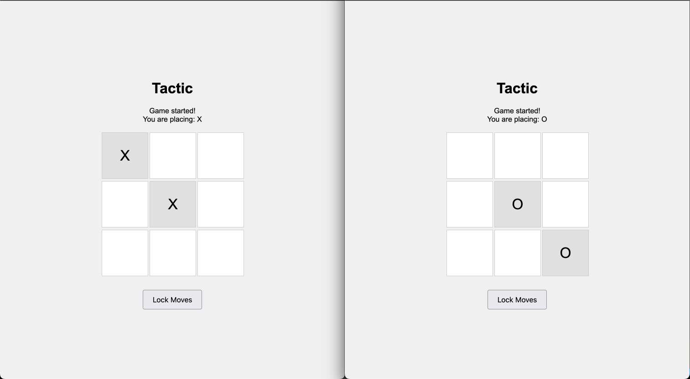
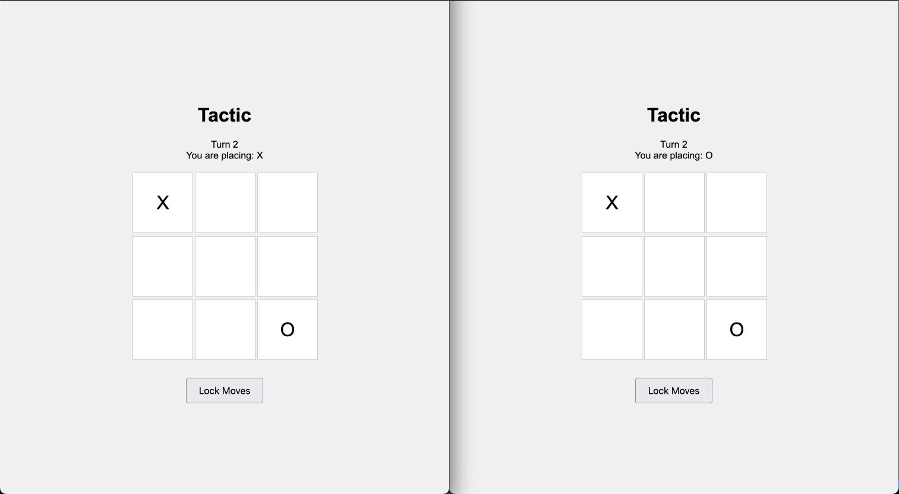
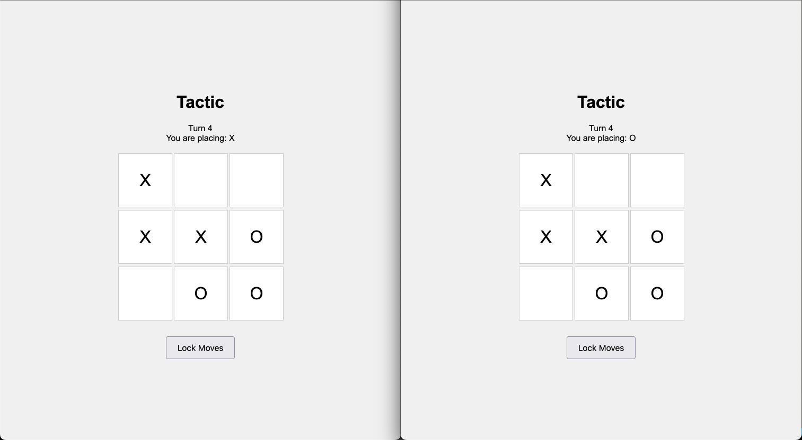

# Tactic

Tactic is a variation of tic-tac-toe where each player proposes two moves at once.
After both players lock their moves, the board is updated to only award each player the squares they proposed that the other player did not.
If both players propose the same two moves on a turn, the board does not change.

## Setup

```sh
npm install
```

## Run

```sh
node server.js
```

Open two browser windows at http://localhost:3000/.

## How to play

Once two windows are open the game with begin.
If somehow the sessions end up in two different rooms, refresh each once.
You should see

> Game started!
> You are placing: <marker>

when the matching occurs successfully.

Select two spaces on the board, then click "Lock Moves".
Do the same in the other window.
Once both players' move proposals are submitted, the board should update.



The process repeats until one player gets three in a row.



If either player clicks "New Game", it starts a new game with the same two players.

## Bugs?

While I got the model to add a few different stalemate checks, it's still possible to end up in a situation where the best two moves for both players are the same.
This state can prevent the game from ending, since the server does not detect a stalemate and both players (if playing an optimal strategy) will repeat the same conflicting moves and the game will not progress.



## Built with Claude Sonnet

This project was created almost entirely with [`claude-3.5-sonnet`](https://www.anthropic.com/news/claude-3-5-sonnet) and Cursor using the same model.
The original prompt used to scaffold the project was

> Hi! I want to create a simple game using web technology. The game is a variation on tic-tac-toe. It will use the same board but the mechanics of playing are slightly changed.
>
> The game has two players.
> Each player proposes two moves then submits them.
> The server receives these two moves then awards the square to a player only that player was the only one of the two to propose the move. If both players propose a move at the same position, neither player gets the square. If neither player proposes a move at a square, nothing happens.
>
> We will start simple. The game cannot start until two players connect to the web server. Manage these two connections over a websocket. When both players join, match them on the server, then notify the client whether it is playing as X or O.
> From here, both players will need to submit moves. Each should select two unoccupied spots from the board, then click a "lock" button in the UI.
> Once, both players select lock, the server should determine the new board state based on the logic described above, then send the new board state to both players.
> This process repeats until on player gets tic-tac-toe or it's not longer possible for either player to win.
>
> When it's no longer possible for either player to win, the client should display a "new game" button to both players on the client. If either player clicks this button, a new game with an empty board should begin.
>
> Please write client and server side code for this game, including any html and css
